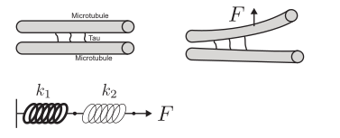

# Problem Set 1: What happens in a composite material?
Jun Allard

Microtubules are rigid polymers that, among other things, provide
mechanical strength inside nerve axons. Several microtubules are bundled
together by bundling proteins, one of which is called Tau. In healthy
axons, Tau exists as individual filaments that are relatively soft
compared to microtubule. In a class of disease called Tau-opathies — of
which Alzheimer’s is the most famous — Tau forms neurofibrilar tangles
in which several Tau molecules tangle together. In either case, the
mechanical properties of the axon are determined by two objects with
different mechanical properties attached in series (stiff microtubules
and soft healthy Tau, or stiff microtubules and even stiffer tangled
Tau).

In this problem, we ask, if the axon is subject to a force, which
mechanical element “takes a bigger hit”?

Suppose a stiff spring with spring constant $k_1$ is connected, in
series, to a soft spring of stiffness $k_{2}=\epsilon k_1$ where
$\epsilon < 1$. Assume each spring has a linear spring energy
$E_i=\frac{1}{2} k_i (\bar{x}_i - x_i)^2$ where $\bar{x}_i$ is the rest
length of spring $i$. Now suppose an extensional force $F$ is applied to
both ends of the pair.

1.  Write the energy of the system $E(x_1,x_2)$. Include the external
    force $F$ using a fictitious potential. Find the mechanical
    equilibrium $(x_1,x_2)$ by minimizing the energy. Tip: You could
    define new configuration variables $\Delta x_i = \bar{x}_i-x_i$ to
    make algebra cleaner.
2.  Which spring is stretched more? By how much?
3.  Which spring experiences a higher tension? By how much?
4.  Which spring stores more elastic energy? By how much?
