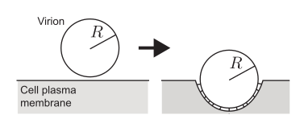

# Problem Set 2: Viral entry
Jun Allard

Membranes, including the plasma membrane that constitutes the outer
envelope of eukaryotic cells, are two-dimensional sheets composed of
lipid bilayers that resist mechanical deformation, like bending. The
bending energy of a surface can be modeled as

$$E = \iint \frac{1}{2} B \kappa^2 \, dA$$

where $B=100\,\mathrm{pN}\,\mathrm{nm}$ is the bending modulus (note it
has units of $\mathrm{pN}\,\mathrm{nm}$, unlike for rods and filaments),
and $\kappa$ is the mean curvature, and the integral $\iint dA$ is over
the membrane’s surface. For a sphere, $\kappa = 2/R$ where $R$ is the
radius of the sphere. For a cylinder, $\kappa = 1/R$ where $R$ is the
radius of the cylinder.

Viruses spread between cells as virus particles, or virions. These
virions are not able to passively enter their host cells; in many cases,
they must hijack the cell’s endocytic machinery to help them actively
gain entry.

1.  Suppose a viral capsid is approximately spherical with radius
    $R=200\,\mathrm{nm}$. How much energy is required to bend the plasma
    membrane to get the capsid half-way into the host cell?
2.  Suppose the cell is under turgor pressure of
    $P=0.01\,\mathrm{pN}/\mathrm{nm}^2$. Now, locally changing the
    volume of the cytoplasm results in an increase in energy
    $\Delta E = PV$, in addition to the energy required to bend the
    membrane. How much energy (bending plus volume change) is required
    to get the capsid half-way into the host cell?
