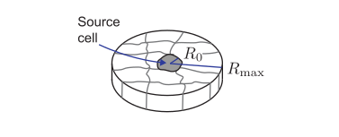

# Problem Set 3: Morphogens in an epithelial sheet
Jun Allard

Many tissues are comprised of two-dimensional sheets of cells, including
epithelial sheets that line the lungs, gut, and blood vessels. The cells
in these tissues communicate by emitting and receiving small diffusive
molecules called ligands.

For mathematical convenience, assume the epithelial sheet is an annulus
(circular disk with a circular hole removed from the center) with inner
radius $R_0$ and outer radius $R_\mathrm{max}$. Assume that the ligand
diffuses only along the two-dimensional surface, so that

$$\frac{\partial c}{\partial t} = D \nabla^2 c \qquad R_0 < r < R_\mathrm{max}$$

where in two dimensions

$$\nabla^2 c(r,\theta) = \frac{1}{r}\frac{\partial}{\partial r} \left(r \frac{\partial c}{\partial r} \right) + \frac{1}{r^2}\frac{\partial^2 c}{\partial \theta^2}.$$

Suppose the source of diffusible ligand is emitted from the center ring
at $r=R_{0}$, so that

$$\begin{aligned}
J(R_0,t) &= J_0,\\
c(R_0,t) &= c_0
\end{aligned}$$

where $J(r,t)$ is the flux in the radial direction. Assume $J_0>0$ so
that it is, indeed, a source of ligand.

Find the steady-state ligand concentration under the following
assumptions:

1.  If the ligand does not bind (or binds and then detaches rapidly)
    from the other cells in the sheet
2.  If the ligand binds irreversibly to other cells at a constant
    internalization rate, $d(r,t)=\gamma$

In the first case, (i), is the flux at $r=R_0$ equal to the flux at
$r=R_\mathrm{max}$?
