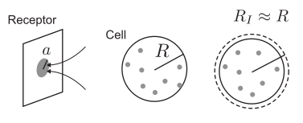

# Problem Set 4: How much do receptors compete?
Jun Allard

A sphere of radius $R$ that is a perfect absorber, in a far-field
concentration $c_{\infty}$ of particles with diffusion coefficient $D$,
will absorb those particles at a rate
$\lambda_\mathrm{perfect} = 4\pi D R c_{\infty}$. This implies that a
cell of radius $R$ that were totally covered in receptors for a
particular ligand would interact with the ligand at rate
$\lambda_\mathrm{perfect}$.

In reality, only a small fraction of the surface of a cell is covered by
receptors for a particular ligand. In this problem, we compute the
interaction rate for a cell with partial absorption.

Assume the cell has radius $R \sim 10\,\mu\mathrm{m}$ and is covered by
$N$ receptors, each of which is a disk of radius
$a \sim 10\,\mathrm{nm}$. We make use of an approximation method that
assumes there is a radius $r=R_I$ that is sufficiently far from the cell
surface, compared to the size of a receptor, that it appears infinitely
far at the scale of this receptor, but is sufficiently close to the cell
surface that, from far away, it appears approximately the same size as
the cell. (By analogy, the planet Earth is of radius $R$, and people on
its surface are of size $a\ll R$. Let $R_I$ be the radius of the Earth’s
stratosphere: At the scale of a person, $R_I$ is very far from the
person, yet at the scale of the solar system, the radius of the Earth
with or without the stratosphere are indistinguishable, i.e.,
$R_I \approx R$.)

1.  An infinite sheet that is no-flux, except for a perfect absorbing
    disk of radius $a$, absorbs particles at rate
    $\lambda_\mathrm{disk} = 4D a c_{I}$ where $c_I$ is the
    concentration sufficiently far from the disk. Therefore the rate at
    which $N$ disks absorb particles is $\lambda_{N} = 4D N a c_{I}$.

    At $r=R_I$, what is the average flux (in particles per time per unit
    area) of particles, $\langle J(R_I)\rangle$? The answer should
    involve $c_I$ (which is unspecified at this stage in the
    calculation).

2.  At the scale larger than the cell, the concentration $c(r)$
    satisfies the steady-state diffusion equation

    $$0 = D \nabla^2 c.$$

    This equation has 3 boundary conditions:

    $$\begin{aligned}
    c(r) &\rightarrow c_{\infty} \qquad \text{as} \qquad r\rightarrow \infty\\
    c(R_I) &= c_I, \\
    J(R_I) &= - D \nabla c.
    \end{aligned}$$

    Note that this type of ODE usually requires 2 boundary conditions,
    but since $c_I$ is unspecified, here 3 boundary conditions are
    needed. Solve the system by making two approximations: First, assume
    $J(R_I) = \langle J(R_I)\rangle$ from part (i). (This corresponds to
    assuming the stratosphere is far from the receptors.) Second, assume
    $R=R_I$ (This corresponds to assuming the stratosphere is close to
    the surface).

3.  What is the rate $\lambda$ at which particles arrive at the surface?
    This will depend on $N$. You should find that as
    $N\rightarrow\infty$, the rate
    $\lambda\rightarrow\lambda_\mathrm{perfect}$, the rate for a
    perfectly absorbing sphere.

4.  How many receptors $N$ are needed to obtain half the
    perfect-absorption rate? At this value of $N$, what fraction of the
    cell’s surface is covered by receptors? You may use
    $R \sim 10\,\mu\mathrm{m}$ and $a \sim 10\,\mathrm{nm}$.

This method of approximation, by assuming an intermediate distance
between two scales, is an example of the Applied Mathematics technique
called *matched asymptotics*.
