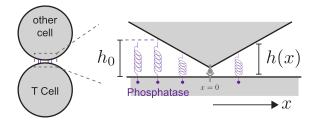

# Problem Set 5: Kinetic segregation
Jun Allard

T Cells have molecules on their surface called phosphatases. These
phosphatases have large bulky extracellular domains. So, when another
cell pushes up against the T Cell, the phophatases get squeezed.
Phosphatases are more squeezed near a receptor, so they tend to move
away from the receptor. This phenomenon is called *kinetic segregation*.

Suppose there is a receptor at $x=0$. For simplicity, let us study the
problem in 1-dimension, and assume the height of the other cell’s
membrane at location $x$ is given by

$$h(x) = \alpha | x |
= \begin{cases}
-\alpha x &\qquad \text{if} \quad x<0 \\
+\alpha x &\qquad \text{if} \quad x>0
\end{cases}
 \qquad(1)$$

Assume the phosphatase molecules are vertical springs, with rest-length
$h_0$ and spring constant $k$, so each one has an energy

$$E = \frac{1}{2}k\left(h - h_0\right)^2 \qquad \text{if} \quad h < h_0.$$

and $E=0$ if $h>h_0$.

1.  As the phosphatase moves to the right away from the receptor, it
    becomes less and less compressed. At what $x$-coordinate will the
    phosphatase molecules not be compressed at all? Call this
    $x_\mathrm{far}$.

2.  If a phosphatase molecule is at coordinate $x$, then given the
    membrane has height $h(x)$ from
    <a href="#eq-membrane-height" class="quarto-xref">Equation 1</a>,
    what is its energy $E(x)$?

    Hint: There will be 4 cases:

    $$\begin{aligned}
    &x < -x_\mathrm{far} \\
    -x_\mathrm{far} < &x < 0 \\
    0 < &x < x_\mathrm{far}\\
    x_\mathrm{far} < &x
    \end{aligned}$$

3.  At steady state, what is the concentration profile of the
    phosphatase $c(x)$?

    Assume that the phophatase undergo diffusion and advection according
    to

    $$\frac{\partial c}{\partial t} = D \frac{\partial^2 c}{\partial x^2} + \mu \frac{\partial}{\partial x} \left( c \frac{\partial E}{\partial x}\right),$$

    which means that the steady-state concentration profile satisfies

    $$c(x) = c_0 \, \exp\left( -\frac{\mu}{D} E(x)\right)$$

    where $c_0$ is an unspecified constant.

4.  What is the concentration at the receptor, $c(0)$, compared to the
    concentration far from the receptor, $c(x_\mathrm{far})$? Express it
    as a ratio. Is it less than half?

    You may assume $D/\mu = 4\,\mathrm{pN}\,\mathrm{nm}$,
    $h_0 = 20\,\mathrm{nm}$, $k = 0.1\,\mathrm{pN}/\mathrm{nm}$, and
    $\alpha = 0.1$.
