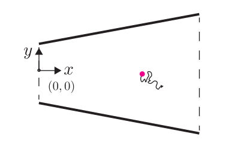

# Problem Set 6: Bacterial export
Jun Allard

Suppose a molecule is diffusing in a two-dimensional wedge-shaped region
with no-flux boundaries

$$\begin{aligned}
y_\mathrm{top}(x) &= mx+b\\
y_\mathrm{bottom}(x) &= -mx-b
\end{aligned}$$

for $0<x<L$, where $m,b,L>0$ are constants. If the diffusion coefficient
is uniform and there are no external forces acting on the molecule, it
will tend to move to the right. In this question we ask, can this
diffusive motion counteract a left-pulling force? And if so, what is the
magnitude of this force?

1.  The microstates of this system are the $(x,y)$ coordinates of the
    molecule. Define a macrostate as the set of $(x,y)$ coordinates with
    a fixed $x$, i.e., vertical slices. Thus we can label macrostates as
    $x$ for $0<x<L$. What is the entropy $S(x)$ of each macrostate $x$?
2.  Assuming no external forces are acting on the molecule — only
    diffusion — write the free energy $G(x) = -TS(x)$.
3.  A gradient in an energy functional corresponds to a force. This is
    true for purely enthalpic energies $E(x)$ and for free energies
    $G(x)$. What is the force $F(x)$ pulling the molecule? It will
    depend on $x$. Which direction does the force pull?

Proteins on the surfaces of cells must be exported from the cell
interior. Some unfolded protein in gram-positive bacteria are exported
by exploiting entropic forces similar to this problem[^1]: The polymer
is held between a region of high entropy and low entropy, and is
effectively sucked into the high-entropy region.

4.  Assume $b=2\,\mathrm{nm}$, $L=100\,\mathrm{nm}$ (the thickness of
    the gram-positive bacterial cell wall), and $m=1$. Use the value of
    $k_BT$ at 30$^\circ$C (note you need to convert temperature to
    Kelvins). The force you found in (iii) depends on $x$. Where is this
    force largest, and what is its magnitude?

[^1]: Halladin et al., “Entropy-driven translocation of disordered
    proteins through the Gram-positive bacterial cell wall”, *Nature
    Microbiology* 2021
