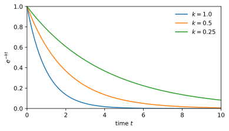

# Python test drive
Jun Allard

## What this notebook is for

Scaffolding, not course material. It exists to prove that the four
things a lecture notebook needs to do all work, in all five output
formats, before any real content is written into one.

Those four things are the four code chunks below. Two of them run when
the site is built, and you are reading their results. Two of them do
not, and are waiting for you to run them.

This document is also the only place in the repository where Python
executes. The problem sets are deliberately language-agnostic: where one
says “write code”, write it in whatever language you intend to use for
the rest of your degree.

## A chunk that runs and produces a number

This one executes during the build. The value below was computed on the
machine that built this page, not typed in by hand.

``` python
import numpy as np

# A number with enough decimals that it could not plausibly have been written out by hand.
# If the build is executing code, this is the reciprocal of the golden ratio; if it is not, this cell shows as unexecuted and the claim is obviously false.
phi = (1 + np.sqrt(5)) / 2
print(f"1/phi = {1 / phi:.12f}")
```

    1/phi = 0.618033988750

## A chunk that runs and produces a figure

Also executed at build time. The figure is generated, not a file
committed to the repository — which is what distinguishes a lecture
notebook from a problem set, whose figures are hand-authored PDFs under
version control.

``` python
import matplotlib.pyplot as plt

t = np.linspace(0, 10, 400)

fig, ax = plt.subplots(figsize=(5.5, 3.2))
for k in (1.0, 0.5, 0.25):
    ax.plot(t, np.exp(-k * t), label=f"$k = {k}$")

ax.set_xlabel("time $t$")
ax.set_ylabel("$e^{-kt}$")
ax.set_xlim(0, 10)
ax.set_ylim(0, 1)
ax.legend(frameon=False)
fig.tight_layout()
plt.show()
```

<div id="fig-decay">



Figure 1: Exponential decay at three rates. Generated at build time by
matplotlib.

</div>

## A chunk that is complete, but left for you to run

The code below is finished and correct. It is deliberately *not*
executed when the site is built, so there is no output here to read —
running it is your job, and it is the simplest test of whether your
setup actually works.

Open this notebook’s `.ipynb` version, put your cursor in the cell, and
run it.

``` python
# Should print the same value as the first chunk above.
# If it does, your environment is running the same numpy the build did.
import numpy as np

phi = (1 + np.sqrt(5)) / 2
print(f"1/phi = {1 / phi:.12f}")
print(f"numpy {np.__version__}")
```

## A chunk that is yours to write

Yours to fill in. Plot $\sin(t)$ against $t$ over the same range as the
figure above, using whatever you can remember or work out from the
second chunk.

A chunk holding nothing but a comment is still a chunk; a chunk holding
nothing at all is dropped from every output, so a stub always needs at
least one line in it.

``` python
# Your code here.
```

## What should be true

If the pipeline is working, then in the `html` and `pdf` versions of
this page the first two chunks show their results and the last two show
only code. In the `.ipynb` version all four arrive as runnable code
cells, and “Run All” completes without error.
